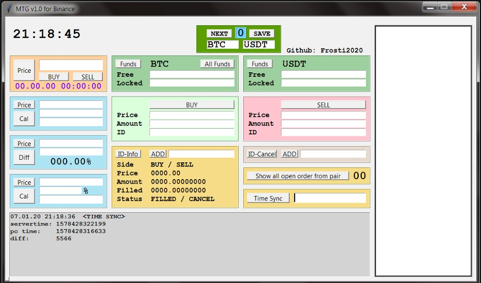

# Welcome to ETG (Easy-Trading-GUI) for Binance v.1.0


Graphical User Interface for trading via REST API.


## Note

This is a manuel trading GUI for Binance, which is created with Python Tkinter module.

Make easy to set an Order via REST API or get the Realtime Asset Price.





## Features


- Create fast `LIMIT ORDER`
- Cancel order
- Get all order information
- Get the amount of your Funds
- Realtime Price
- Some calculators for fast calculate
- No unknown libraries
- One File/Script `ETG_binance_v1_0.py` (easy to look over)


## Requirements

```python
    import tkinter as tk
    import time
    import json
    import requests
    from threading import Thread
    import hashlib
    import hmac
```
###  Binance Account
#### Create a Binance Account and activate an API-Key

[https://www.binance.com/de/register?ref=36368250](https://www.binance.com/de/register?ref=36368250)

## Tutorial Guide

Please check the Guide before use

[Tutorial.md](./Tutorial.md)


## Donate

Feel free to support my motivation for new Updates:

| Asset   | ADDRESS                                     |
|-------- |-------------------------------------------- |
| BTC     | 14W14xpdy7qSQsJA8koPbLSNV7pS231Mvr          |
| ETH     | 0xC030B5176057fc234B73A315204d92631B649bD1  |
| BNB     | bnb1eezams8lr74c8tzrw2f3shnzkfl9qxw6dxf7vh  |
| BCH     | qzh286hdvn97hrxprlr6q8sqzrxgkselnqcg890a4x  |
| LTC     | LZPZ5KKb3tgoihPSEjnhbn8brggrsDEFnE          |

## Kontakt

Please Kontakt me for Feedback, Ideas and Questions.


`@Frosti_ger`

