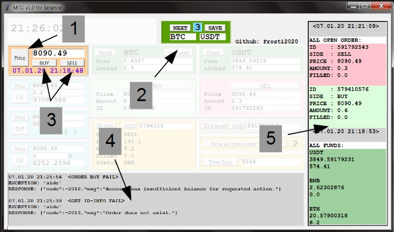
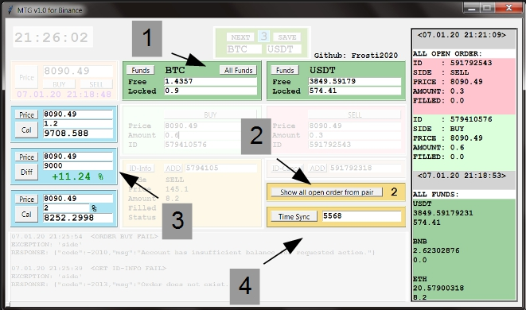
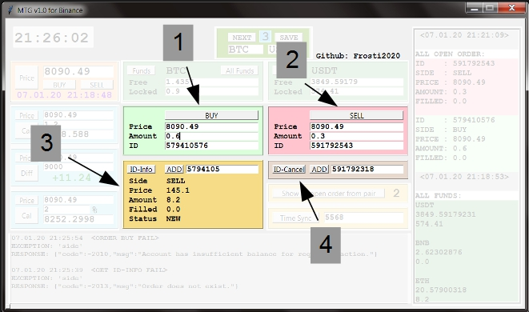
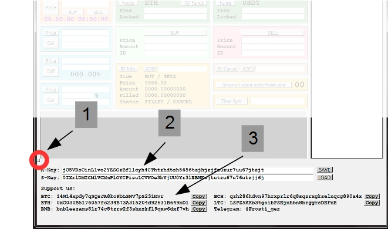

# Tutorial Guide

#### 1. Get Price from entered pair
#### 2. Enter trading pair. Save* and load 5 pairs 
##### * `etg_binance.txt` will be created in the same Folder
#### 3. Inserts Price in the BUY/SELL Box
#### 4. Exception and response window
#### 5. All important Infos from requests

#### 1. Show all Funds from Account
#### 2. Show all open order from entered pair
#### 3. Calculators
- Multiply price with amount 
- difference between two prices
- percent difference from price
- The `Price` Button inserts price from price box
#### 4. Sync pc-time with server-time
- It runs automatically, but sometimes you have to do it manually

#### 1. Create `Limit buy order`*
#### 2. Create `Limit sell order`*
##### * after sending a request the ID appear 
#### 3. Get all Infos about order*
#### 4. Cancel the entered order*
##### *You can mark with double click the order-ID in the Buy, Sell or Info Box. And the `ADD` Button add it in the entry 

#### 1. A small `Button` left/down open the Key area
#### 2. Enter Keys. If you want you can save them* 
##### *  will be saved in `etg_binance.txt`
- When keys have been saved. They will be loaded automatically by start
#### 3. Donation area. `Copy` the adress to the Clipboard and feel free to support me.

## That's it.

### There is no warning before sending order requests. Please be careful of mistyping!
### Read the Binance API Docs for Error Codes

[Binance-official-api-docs](https://github.com/binance-exchange/binance-official-api-docs/blob/master/rest-api.md)